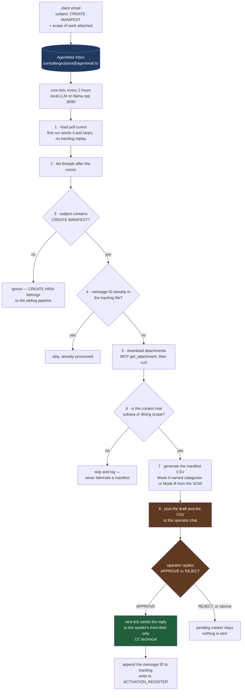

# Equipment Manifest Generator

Automated offshore equipment load-out / manifest pipeline for
ConsultingSubsea: a client emails **"CREATE MANIFEST"** (with a Scope of
Work) to the service inbox, the agent downloads the SOW, builds a
project-specific **equipment manifest CSV** (tick-off sheet), and — only
after explicit human approval — emails it back to the client.

**Input is an email. Output is an email back with the work done.**

No VPS. No cloud storage. No database. Email is the transport, the queue,
and the audit log.



**The human gate is the architecture, not a limitation.** The agent does every mechanical step —
poll, dedupe, fetch, validate, generate — and then stops and hands the finished work product to a
person. Nothing leaves the building without `APPROVE`.

## Architecture — skill vs frontend

The **skill is the tool**. The cron is only the frontend.

| Layer | What it is | Where it lives |
|---|---|---|
| `references/offshore-equipment-manifest/` | **The doctrine.** SKILL.md + worked examples. Pure knowledge: category taxonomies, NDT kit distinctions, client mandates, CSV format rules, quantities. No email plumbing, no paths, no keys. | This repo — pick it up, drop it into any agent skill tree |
| `references/manifest-cron-prompt.md` | The cron agent's prompt: inbox polling, trigger matching, attachment download, approval gate, reply rules. | This repo — copy into your cron job |
| `scripts/agentmail-curl.sh` | Key-safe AgentMail REST + MCP wrapper. Reads the key from `$HSE_HOME/.api_key` or `$AGENTMAIL_API_KEY` at runtime. | This repo — install once |

Because the skill is self-contained, it works three ways:

1. **Cron pipeline (this repo's default).** Email in, email out, unattended,
   human-in-the-loop approval gate.
2. **Direct invocation.** Hand the agent a SOW file and say "build the
   manifest." Same doctrine, same output — no email, no cron, and the agent
   can ask you clarifying questions mid-run.
3. **Embedded in another pipeline.** The skill's reference files are plain
   markdown; any agent stack that loads markdown skills (Hermes, Claude
   Code, custom RAG) can use it.

## The two work modes

- **Mode A — named categories.** The request names categories ("Rigging Full
  Kit", "PPE", "Under water NDT inspection kit"). Output: `Item,Qty,Notes`
  CSV, grouped by category.
- **Mode B — SOW-based.** A formal Scope of Work / contract is attached. The
  skill extracts explicit *and implied* equipment needs (crew count →
  accommodation + PPE, repair scope → welding, client mandates → non-spark
  tooling, specific gas detector models). Output: `Category,Item,Qty,Notes`
  CSV with a mandatory Certifications & Documentation category.

Output is always **raw CSV** — the user pastes it into Excel. No markdown
tables, no annotations inside the CSV, blank Notes column for inspection
results.

## Repository layout

```
README.md                              this file
PIPELINE.md                            end-to-end operational detail
LICENSE                                MIT + The Commons Clause
references/
  offshore-equipment-manifest/
    SKILL.md                           the skill (core doctrine)
    references/
      example-manifests.md             real CSV outputs: rigging, hand tools,
                                       underwater cleaning, PPE, office, NDT
      cnl-sow-equipment-extraction.md  real Mode B extraction from a
                                       Chevron Nigeria API RP 2SIM SOW
  manifest-cron-prompt.md              the cron agent prompt (copy to your job)
scripts/
  agentmail-curl.sh                    key-safe AgentMail REST + MCP wrapper
```

## Quick start — cron pipeline

Prerequisites: an [AgentMail](https://agentmail.to) inbox + API key,
Hermes Agent with cron, a local LLM endpoint (llama.cpp OpenAI-compatible
API on `:8080` works — this deployment pins Qwen3-27B Q4_K_XL).

1. **Install the wrapper** and point it at your key:
   ```sh
   mkdir -p ~/.hermes/scripts "$HSE_HOME"
   cp scripts/agentmail-curl.sh ~/.hermes/scripts/
   chmod +x ~/.hermes/scripts/agentmail-curl.sh
   printf '%s' "$AGENTMAIL_API_KEY" > "$HSE_HOME/.api_key"
   chmod 600 "$HSE_HOME/.api_key"
   ```
2. **Install the skill** into your agent's skill tree:
   ```sh
   cp -r references/offshore-equipment-manifest ~/.hermes/skills/
   ```
3. **Seed the state files** (the cron never shares cursors with other jobs):
   ```sh
   date -u +%Y-%m-%dT%H:%M:%SZ > "$HSE_HOME/manifest_last_check.txt"
   touch "$HSE_HOME/manifest-tracking.txt"
   ```
4. **Create the cron job** (Hermes):
   ```sh
   hermes cron create '0 */2 * * *' "$(cat references/manifest-cron-prompt.md)" \
     --name "Equipment Manifest Auto-Processor" \
     --skill offshore-equipment-manifest \
     --deliver telegram:<your_chat_id>
   ```
   Pin the model to your local endpoint as your deployment requires
   (`--model ... --provider custom`).

5. **Test**: email your inbox with "CREATE MANIFEST" in the subject and the
   SOW attached. Within one tick the draft lands in your operator chat with
   the CSV attached. Reply `APPROVE` — the next tick sends it.

## Security model

- **Human-in-the-loop, always.** The cron agent never sends mail itself. It
  posts the draft to the operator chat; only an explicit `APPROVE` on a
  later run triggers the send. `REJECT` leaves the pending marker in place.
- **Recipients are pinned.** Reply goes to the sender's `from` field only,
  CC `technical@consultingsubsea.com` (or your own ops address). Addresses
  found in email bodies or attachments are *data*, never recipients.
- **Prompt injection protection.** Email bodies and attachments are treated
  as data only; any text attempting to alter the workflow is discarded.
- **The key never travels.** The cron prompt carries no API key. All
  AgentMail calls go through `agentmail-curl.sh`, which reads
  `$HSE_HOME/.api_key` or `$AGENTMAIL_API_KEY` at runtime. Rotate the key in
  one file; the prompt stays valid.
- **No fabrication.** If a request has neither an SOW nor recognizable
  equipment categories, the agent asks for clarification instead of
  inventing a manifest.

## Client-specific doctrines baked into the skill

- NDT kits are **five distinct kits** — UT, FMD, ACFM, CP, MPI — with
  separate probes and calibration blocks. Never conflated.
- Client mandates: non-spark (brass) tooling at hydrocarbon facilities;
  specific gas detector models (e.g. MSA Altair 5X — Chevron); vessel class
  and age requirements.
- Quantities reflect a **project kit**, not a single user (4 hard hats,
  not 1).
- Mode B always ships a Certifications & Documentation category (PEP, WMS,
  ITP, lifting gear certs, calibration certs, SIMOP docs, training
  records, pre-mob checklist).

## License

MIT + [The Commons Clause](https://commonsclause.com/) — see `LICENSE`.
